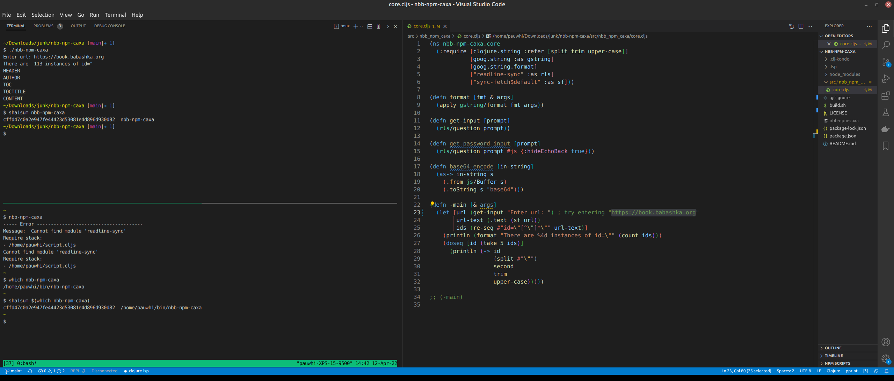

# nbb-npm-caxa
A Clojurescript nbb (sci) app that has two npm dependencies, and is packaged with caxa into a native executable.

## Issue
The native executable will not successfully execute from outside of the development directory.

